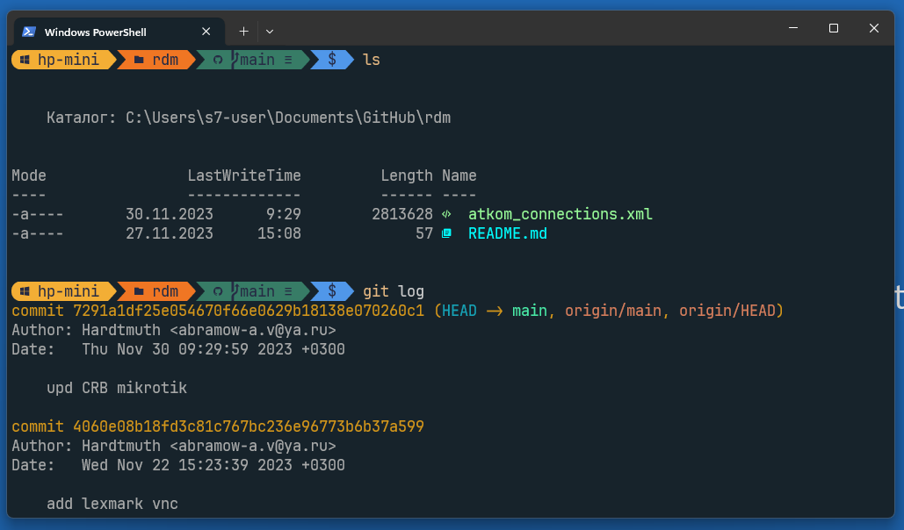

1. Install oh-my-posh:

```powrshell
winget install JanDeDobbeleer.OhMyPosh -s winget
```
2. Enable scripting:

```powrshell
Set-ExecutionPolicy RemoteSigned
```

3. Change your prompt:

```powrshell
notepad $PROFILE
```
Paste in profile file:
```
oh-my-posh init pwsh | Invoke-Expression
```

4. Install Nerd Font and change in Terminal

```powrshell
winget install --id  DEVCOM.JetBrainsMonoNerdFont
```

5. Install Terminal Icons module:

```powershell
Install-Module -Name Terminal-Icons -Repository PSGallery
```

Then reload terminal

Now yoh have beatiful terminal. And You may [change theme](https://ohmyposh.dev/docs/installation/customize).

windows terminal example
